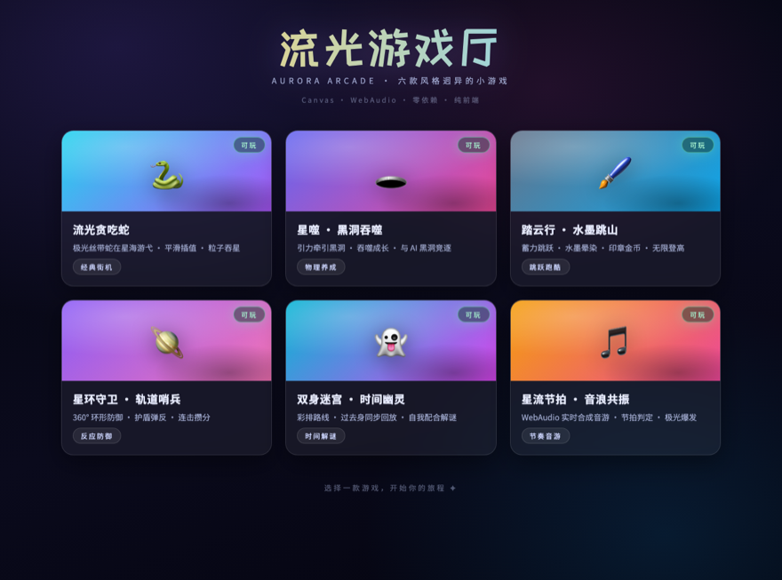
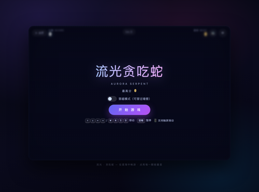
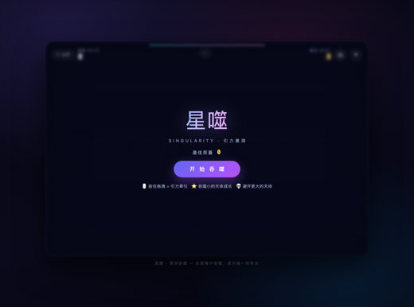
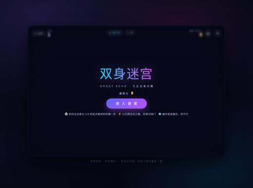
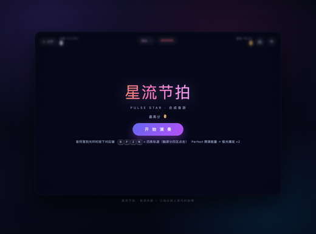

# 🎮 流光游戏厅 · DeepSeek Arcade

**6 款风格迥异的纯前端小游戏 —— 全部由 DeepSeek AI 在 [deepseek-harness](https://github.com/deepseek-ai/deepseek-harness) 中自动开发、测试与验证。**

<p align="center">
  <a href="https://juicyzhou.github.io/deepseek-arcade/"><b>▶ 立即在线试玩</b></a>
  &nbsp;·&nbsp;
  <a href="#-本地运行">本地运行</a>
  &nbsp;·&nbsp;
  <a href="#-项目介绍">项目介绍</a>
</p>

<p align="center">
  <a href="https://juicyzhou.github.io/deepseek-arcade/">
    
  </a>
</p>

## 🎮 点击截图 · 直接进入游戏

| [](https://juicyzhou.github.io/deepseek-arcade/games/snake/) | [](https://juicyzhou.github.io/deepseek-arcade/games/singularity/) | [](https://juicyzhou.github.io/deepseek-arcade/games/ink-leap/) |
|:---:|:---:|:---:|
| 🐍 流光贪吃蛇 | 🕳️ 星噬 · 黑洞吞噬 | 🖌️ 踏云行 · 水墨跳山 |

| [](https://juicyzhou.github.io/deepseek-arcade/games/orbital/) | [](https://juicyzhou.github.io/deepseek-arcade/games/ghost-echo/) | [](https://juicyzhou.github.io/deepseek-arcade/games/pulse-star/) |
|:---:|:---:|:---:|
| 🪐 星环守卫 · 轨道哨兵 | 👻 双身迷宫 · 时间幽灵 | 🎵 星流节拍 · 音浪共振 |

## ✨ 项目介绍

从极光星海的**流光贪吃蛇**，到引力**黑洞吞噬**、水墨**登高**、环形**防御**、回声**解谜**与**合成音游**——
六种截然不同的美学与玩法，一个大厅自由选择，即开即玩，零依赖零构建。

本项目最大的特别之处在于**生产方式**：全部代码、交互设计、测试用例与视觉风格，
均由 DeepSeek AI 在 deepseek-harness 中自动生成、自我审查并逐项验证，
是「AI 原生软件开发」的完整可运行样例。

## 🧪 质量验证

每款游戏均通过 `node --check` 语法校验、Node 逻辑冒烟测试（23~27 项断言，
基于 `tools/dom_stub.js` 桩环境，多轮复跑全绿）与无头浏览器截图 + 像素分析验证。

## ▶️ 本地运行

```bash
open index.html                        # 直接打开
python3 -m http.server 8000            # 或本地服务器，访问 http://localhost:8000
```

## 🚀 部署

纯静态站点，已内置 [GitHub Actions 工作流](.github/workflows/pages.yml)，
推送到 `main` 即自动部署至 GitHub Pages。

## 🗂️ 目录结构

```
├── index.html / hub.js / style.css    # 游戏大厅
├── tools/dom_stub.js                  # 共享测试桩（Node 模拟 DOM/Canvas）
├── screenshots/readme/                # README 展示图
└── games/
    ├── snake/        流光贪吃蛇
    ├── singularity/  星噬 · 黑洞吞噬
    ├── ink-leap/     踏云行 · 水墨跳山
    ├── orbital/      星环守卫 · 轨道哨兵
    ├── ghost-echo/   双身迷宫 · 时间幽灵
    └── pulse-star/   星流节拍 · 音浪共振
```

每个游戏独立可玩（`games/<名字>/index.html`），含 `game.js`（引擎）、`style.css`（样式）、`test.js`（测试）与 `README.md`（玩法）。

## 🛠 技术底座

Canvas 2D · WebAudio 合成音效 · localStorage 记录 · 键盘 + 触屏 · 中文 UI · 状态机
